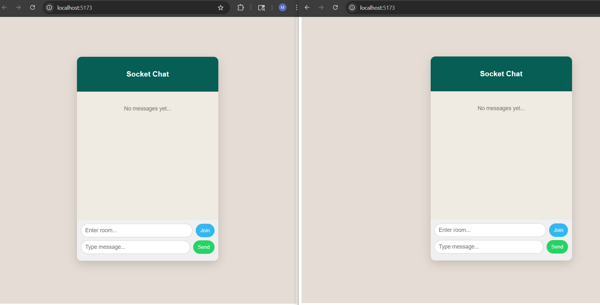
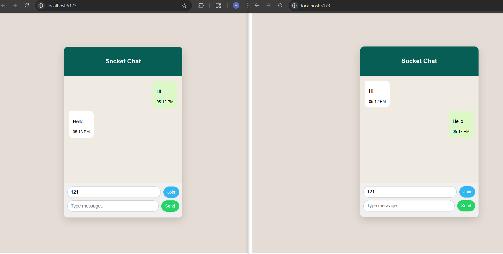

# 📡 Chat App using Socket.IO

A simple real-time chat application built with **React** and **Socket.IO** that allows users to join rooms and exchange messages instantly.

---

## 🚀 Features

- 🔗 Real-time communication using Socket.IO  
- 🏠 Join chat rooms dynamically  
- 💬 Send and receive messages instantly  
- 📜 Chat history (session-based)  
- ⏱ Message timestamps  
- 📱 Clean and responsive UI  
- ⚡ Auto-scroll to latest message  

---

## 🛠️ Tech Stack

### Frontend
- React (Hooks)
- CSS
- Socket.IO Client  

### Backend
- Node.js  
- Express.js  
- Socket.IO  

---

## ⚙️ How It Works

This application uses **event-based communication** between client and server via Socket.IO.

### Client connects to server:
main.jsx and index.js
---
### Socket events
| Event Name        | Description                 |
|------------------|-----------------------------|
| `join_room`      | Join a specific chat room   |
| `send_message`   | Send message to server      |
| `receive_message`| Receive message from server |

## ▶️ Getting Started

### 1. Clone the Repository

```
git clone https://github.com/mkarthikpai/Chat-App-Socket-IO.git
cd Chat-App-Socket-IO
```
### 2. Install Dependencies

#### Client
```
cd client
npm install
```
#### Server
```
cd server
npm install
```
### Run Both
```
npm start
```
## 📸 Output

| Chat Window 1 | Chat Window 2 |
|---------------|----------------|
|  |  |
